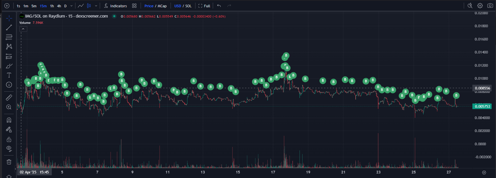

# Auto Buybot

Auto Buybot is a lightweight script that automatically buys a token of your choice whenever new SOL is detected in your wallet. 

It's perfect for auto-compounding strategies, auto-buybacks, or any setup where you want instant reaction to incoming SOL.

## ✨ Features

- 🔥 Monitors multiple wallets
- 🔥 Auto-buys your target token when new SOL arrives
- 🔒 Encrypted secret key storage (`.env.enc`)
- 📦 Simple setup wizard
- 🛡️ Safe password-protected environment loading
- ⚡ Supports custom RPC endpoints (`config.json`)

## 🔐 Security Warning

> **Your private keys are extremely sensitive!**  
> 
> This script requires access to your wallet's secret keys. This software **stores secret keys in an encrypted `.env.enc` file**.
> 
> If your `.env.enc` file is accessed by malware or if a third party gains access to it, **your wallet(s) could be compromised** and all funds could be stolen.  
> 
> For maximum security, it is strongly suggested to run this script on a **dedicated computer with a fresh operating system install**, used **solely** for running the bot.  Don't use the internet on this machine!
> 
> Always take appropriate security measures when handling private keys.  Don't email them.  Don't share them.
> 
> The creator of this script is **not responsible** for any loss of funds or security issues resulting from the use of this code.

## 🛠 Installation Steps

### 1. Install Node.js v20+

This project requires **Node.js version 20 or higher**.

Check your version:

```bash
node --version
```

If you have an older version, install the latest Node.js:

- Visit [https://nodejs.org/en/download](https://nodejs.org/en/download)
- Download and install **Node.js 20.x (LTS)** for your operating system
- After installing, verify:

```bash
node --version
# Should output something like v20.11.0
```

---

### 2. Clone this repository

```bash
git clone https://github.com/yourusername/auto-buybot.git
cd auto-buybot
```

---

### 3. Install dependencies

```bash
npm install
```

This will install all required Node.js modules.

---

### 4. Run the setup wizard

```bash
npm run setup
```
or
```bash
node setup-bot.js
```

This will:
- Collect your wallet secret keys
- Configure your target tokens
- Encrypt your secrets into `.env.enc`
- Generate an initial `config.json`

---

### 5. (Optional) Manually edit config.json

After setup, you can **manually edit** `config.json` at any time to:

- Change the token each wallet purchases
- Change wallet names
- Update your RPC endpoint

**You do NOT need to re-run setup unless you want to change private keys.**

---

### 6. Start the bot

```bash
npm run start
```
or
```bash
node main.js
```

The bot will:

- Prompt you for your `.env.enc` decryption password
- Monitor your wallets
- Automatically buy your configured tokens when new SOL is received

---

# ⚡ Quick Commands Summary

| Command | Purpose |
|:--------|:--------|
| `npm install` | Install all project dependencies |
| `npm run setup` | Run interactive setup wizard |
| `npm run start` | Launch the Auto Buybot |

---


